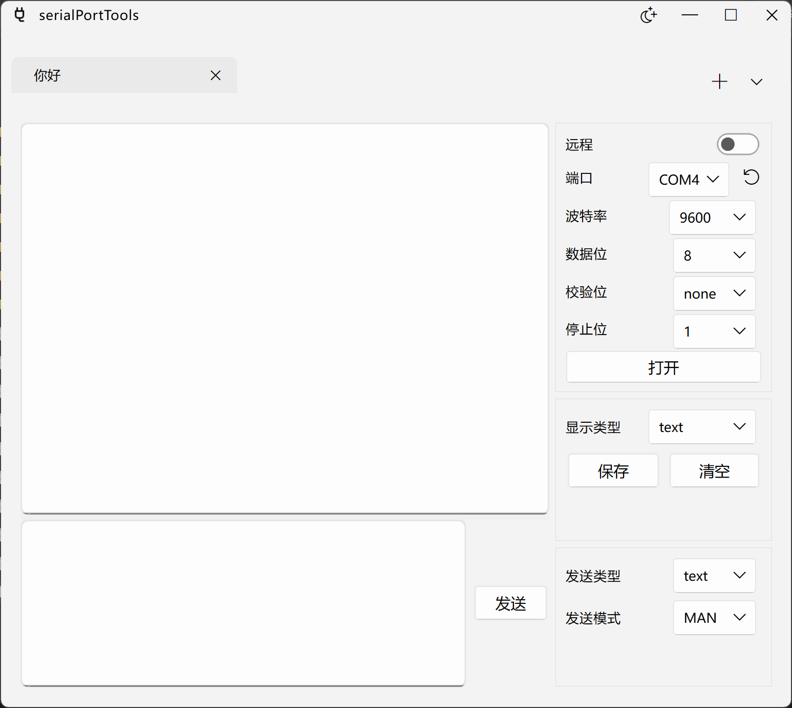
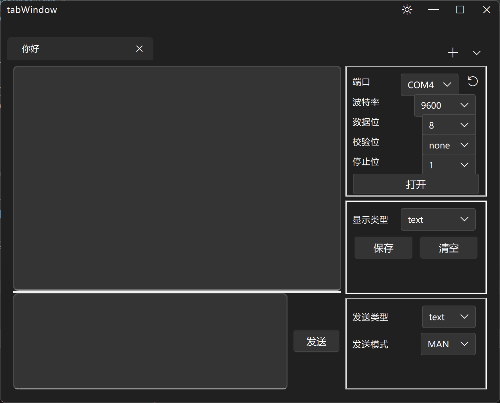
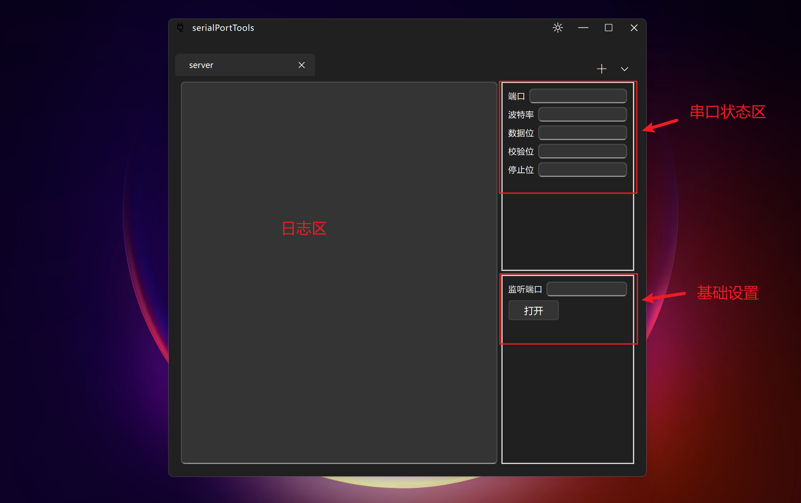
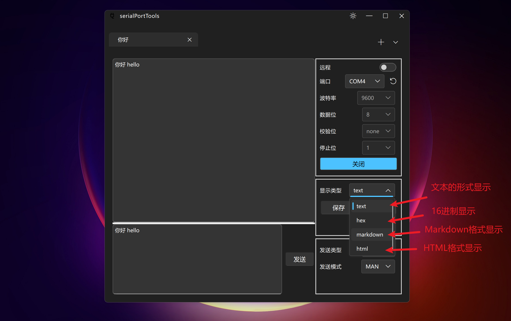
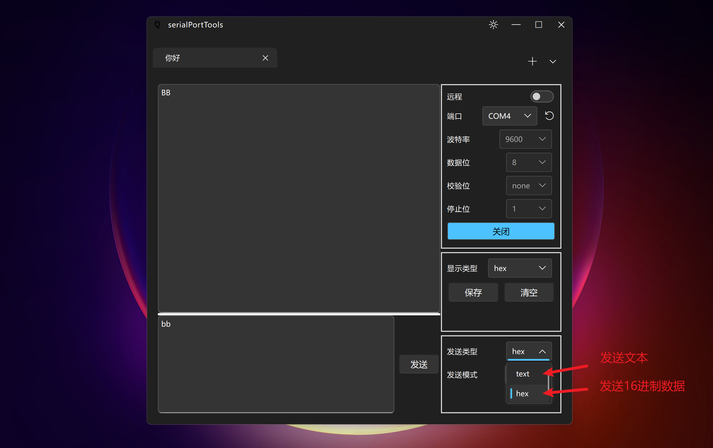
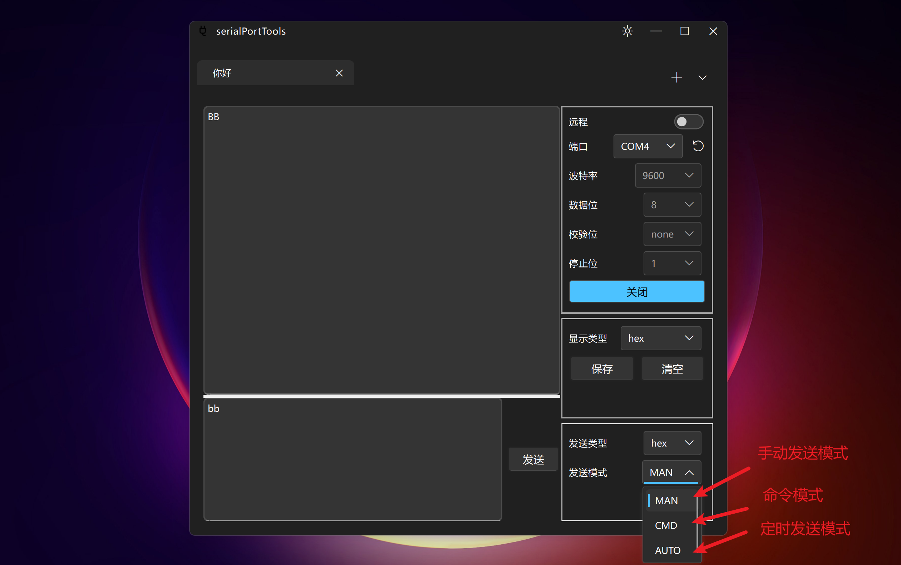

#  serialPortTools


## 简介

本项目是一个串口助手

## 程序截图



> 目前完美支持浅色模式和深色模式

## 使用文档

### 串口客户端

#### 整体布局



#### 接收区设置



> 注意: Markdown模式和 HTML模式一定要接收到正确的格式才会正常显示

#### 发送区设置





### 串口服务器

#### 整体布局


## 支持平台

| Windows      | Debian(***Todo***) |
|--------------|--------------------|
| ![win-badge] | ![ubuntu-badge]    |

> 在Windows11上成功编译, **在Debian上待开发**

[win-badge]: https://img.shields.io/badge/Windows-Passing-61C263

[ubuntu-badge]: https://img.shields.io/debian/v/apt

## 使用的第三方库和对应的版本

- [Qt](https://github.com/qt) v6.4
- [ElaWidgetTools](https://github.com/Liniyous/ElaWidgetTools) Latest
- [itas109::CSerialPort](https://github.com/itas109/CSerialPort) v4.3.2
- [maddy](https://github.com/progsource/maddy) v1.3.0
- [concurrentqueue](https://github.com/cameron314/concurrentqueue) v1.0.4
- [ThreadPool](https://github.com/progschj/ThreadPool) Latest
- [nlohmann::json](https://github.com/nlohmann/json) v3.11.3

## 拉取该项目,并加载子模块
```shell
git clone --recursive https://github.com/aiwang23/serialPortTools.git
```

## 编译

> 请把[CMakeLists.txt](CMakeLists.txt)的下述变量 修改自己电脑的Qt安装路径
> - CMAKE_PREFIX_PATH

### Windows10+

本项目编译器使用 msvc2022

```shell
cmake -S . -B ./build/
cmake --build ./build/
```

## 国际化

目前支持简体中文和英语的切换, 后续后添加更多语言支持, 有其他语言需求的, 请自行配置语言

### 生成 ts文件

```powershell
lupdate -recursive . -ts res/translations/zh_CN.ts res/translations/en_US.ts
```

### ts文件 -> qm文件

```
lrelease res/translations/zh_CN.ts res/translations/en_US.ts
```

然后在 [resources.qrc](resources.qrc) 添加 qm文件路径

