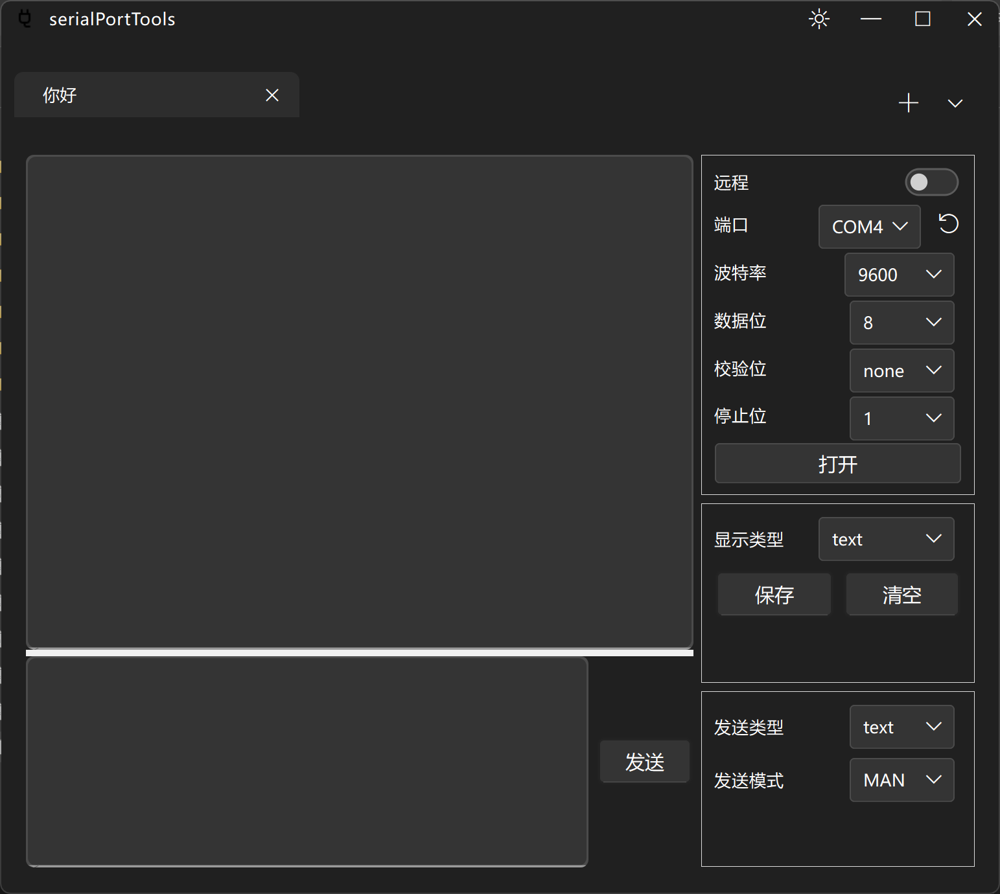

# serialPortTools

## 简介

本项目是一个串口助手

## 程序截图



> 目前完美支持浅色模式和深色模式

## 支持平台

| Windows      | Debian(***Todo***) |
|--------------|--------------------|
| ![win-badge] | ![ubuntu-badge]    |

> 在Windows11上成功编译, **在Debian上待开发**

[win-badge]: https://img.shields.io/badge/Windows-Passing-61C263

[ubuntu-badge]: https://img.shields.io/debian/v/apt

## 使用的第三方库
- [Qt](https://github.com/qt) 6.4
- [ElaWidgetTools](https://github.com/Liniyous/ElaWidgetTools)
- [CSerialPort](https://github.com/itas109/CSerialPort)
- [maddy](https://github.com/progsource/maddy)
- [concurrentqueue](https://github.com/cameron314/concurrentqueue)
- [ThreadPool](https://github.com/progschj/ThreadPool)

## 编译
> 编译编译本项目之前 先编译以下的库
> - [ElaWidgetTools](https://github.com/Liniyous/ElaWidgetTools)
> - [CSerialPort](https://github.com/itas109/CSerialPort)

> 请把[CMakeLists.txt](CMakeLists.txt)的下述变量 修改自己电脑的第三方库安装路径 
> - CMAKE_PREFIX_PATH 
> - ELA_LIB_PATH
> - C_SERIAL_PORT_LIB_PATH

```shell
cmake -S . -B ./build/
cmake --build ./build/
```

## 国际化
目前支持简体中文和英语的切换, 后续后添加更多语言支持, 有其他语言需求的, 请自行配置语言

### 生成 ts文件
```powershell
lupdate -recursive . -ts res/translations/zh_CN.ts res/translations/en_US.ts
```

### ts文件 -> qm文件

```
lrelease res/translations/zh_CN.ts res/translations/en_US.ts
```

然后在 [resources.qrc](resources.qrc) 添加 qm文件路径

